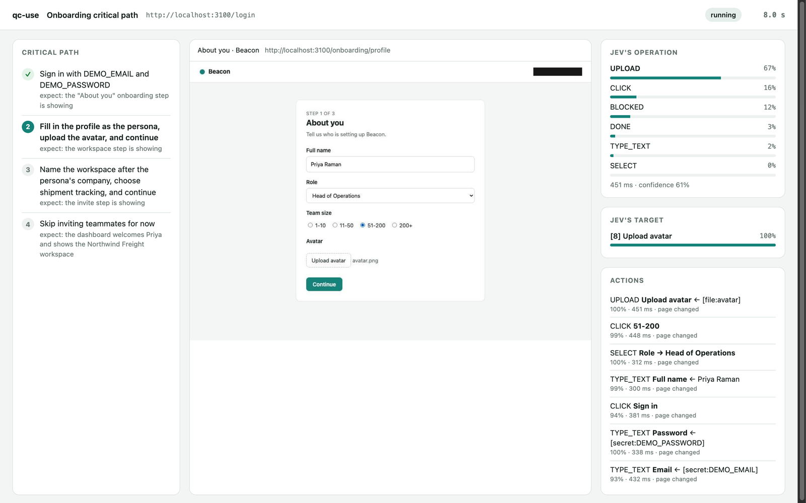

<h1 align="center">qc-use</h1>

<p align="center"><b>Test the most important path in your app. Describe it in plain words.</b></p>

<p align="center">
  Powered by <a href="https://docs.typesafe.ai/introduction">TypeSafe Jev</a> ·
  The browser runs on your machine ·
  <a href="LICENSE">MIT license</a>
</p>

<p align="center"></p>

You write a test like a note to a new teammate:

```md
1. Sign in with LOGIN_EMAIL and LOGIN_PASSWORD
   - expect: the onboarding screen is showing
2. Finish onboarding as a Head of Operations at a 50-person company
   - expect: the dashboard shows the new workspace
```

qc-use opens a private Chrome window and does each step. Then it checks the result. You get a pass or a fail for each step, with the reason and a screenshot.

## Start with one message

Paste this into your coding agent (Claude Code, Codex, Cursor, Gemini CLI, Copilot, or opencode):

```text
Install or upgrade qc-use with uv using Python 3.12:
uv tool install --python 3.12 --upgrade git+https://github.com/aadilghani1/qc-use
Then run `qc-use skill install` to register the skill, and `qc-use doctor` to check the setup.
If setup fails, follow https://github.com/aadilghani1/qc-use/blob/main/install.md
```

Then ask your agent: **"Test our onboarding critical path on localhost:3000."**

The agent writes the test file and shows you the steps. When you agree, it runs the test and explains the report.

## Try it in one minute

qc-use has a small demo app called Beacon. The demo runs 3 tests against it.

```bash
uv tool install --python 3.12 git+https://github.com/aadilghani1/qc-use
export AI_GATEWAY_API_KEY=your-key   # a Vercel AI Gateway key
qc-use demo
```

You see one result of each kind:

| Test | Outcome | What happens |
| --- | --- | --- |
| Onboarding | ✅ pass | qc-use signs in, fills the profile, uploads an avatar, and reaches the dashboard. |
| Invite a teammate | ❌ fail | The demo server returns HTTP 500. qc-use catches the bug and shows the evidence. |
| Delete the workspace | ✋ needs approval | qc-use stops before it deletes data and asks a person. |

## Why qc-use

- **Plain words, not code.** You write no selectors and no scripts. When the UI changes, you usually do not need to change the test.
- **Jev chooses. It does not write.** On each page, qc-use makes a list of the elements. Jev chooses the next action and one element from that list. Jev cannot invent a selector or run code.
- **Proof, not claims.** After each step, qc-use reads the page again and checks your expectation. A "done" from the model is not enough.
- **Secrets stay on your machine.** A test file contains secret names only. Code types the values. Reports hide them. Screenshots are masked or omitted when masking cannot be checked.
- **Safe by default.** qc-use checks links and page addresses against your allowed sites. Its gate checks chosen actions for destructive changes, payments, and messages.
- **Measured runs.** Each report includes elapsed time, model calls, and reported or estimated cost. Unknown pricing stops further model requests.

## Write a test

A test file is Markdown. The settings go between the `---` lines. The steps go below.

```md
---
url: http://localhost:3000/login
secrets: [LOGIN_EMAIL, LOGIN_PASSWORD]
persona:
  role: Head of Operations
  company_size: 51-200
rate:
  onboarding_ease: [confusing, effortful, okay, smooth, effortless]
---
# Onboarding critical path

A new user signs in for the first time and finishes onboarding.

1. Sign in with LOGIN_EMAIL and LOGIN_PASSWORD
   - expect: the first onboarding screen is showing
2. Complete the profile as the persona and continue
   - expect: the workspace step is showing
3. Create a workspace and finish onboarding
   - expect: the dashboard shows the new workspace
   - check: url contains /dashboard
```

| Part | What it does |
| --- | --- |
| `url` | The page where the test starts. Use localhost, a staging site, or a preview site. |
| `secrets` | Names of private values. Put the values in `qa/.env` or in your environment. |
| `persona` | Facts about the user that qc-use acts as. qc-use uses them to fill forms. |
| `rate` | Optional. Jev rates the whole run on these levels, from worst to best. |
| Numbered lines | The steps. Each step says what to do. |
| `expect:` | What the page must show when the step works. Jev checks it on a fresh read of the page. |
| `check:` | An exact check by code: `url contains X`, `url matches REGEX`, `title contains X`, `text contains X`, or `text does not contain X`. |

Run `qc-use init` to create a `qa/` folder with an example. The full format is in [docs/test-files.md](docs/test-files.md).

## Run a test

Your coding agent reads the project, starts the local app, and writes the requested critical path.
The CLI runs that test file. It does not generate tests from a prompt by itself.
Review the generated steps and use a disposable test account.

```bash
qc-use validate qa/onboarding.md --json # offline; no Chrome or model calls
qc-use doctor qa/onboarding.md --json   # check setup and the start URL
qc-use skill status                    # find outdated installed instructions
qc-use report qa-results/<run-id>       # reopen saved step evidence; Ctrl+C closes it
```


For manual OTP or OAuth sign-in, use a dedicated profile in an interactive terminal:

```bash
qc-use run qa/onboarding.md --manual-auth --profile /tmp/qc-use-login --watch
```

```bash
qc-use run qa/onboarding.md            # run one test
qc-use run qa/onboarding.md --watch    # also open the live view
qc-use run qa/*.md --repeat 3          # requires repeat_safe: true and repeatable test accounts
qc-use demo --watch                            # visible Chrome and live inspector
qc-use demo --headless --results /tmp/qc-use-demo  # keep demo reports outside your project
```

Each run writes a folder in `qa-results/`:

- `report.md`: the result for people, with a screenshot of each step.
- `report.json`: the result for programs and coding agents. Run `qc-use schema report` to see its format.
- `trace.json`: every decision that Jev made, for debugging.

The exit code tells your agent or your CI what happened:

| Exit code | Outcome | Meaning |
| --- | --- | --- |
| 0 | pass | Every step works. |
| 1 | fail | An expectation or an exact check is false. The app probably has a bug. |
| 2 | inconclusive or blocked | qc-use is not sure, or it cannot continue. The report says why. |
| 3 | needs approval | The next action can break a never-do rule. A person must allow it. |
| 4 | setup error | The test file, a secret, a key, or the URL is not ready. Nothing ran. |

## How it works

```text
  read the page ──► list of elements ──► Jev chooses the action and the element ──► code does the action
        ▲                                                                                   │
        └──────────────────────── read the page again ◄─────────────────────────────────────┘

  when the step is done: read the page again ──► check each expectation ──► pass, fail, or inconclusive
```

1. qc-use starts Chrome with a new, empty profile.
2. For each step, qc-use reads the page and makes a list of the elements on it.
3. qc-use sends Jev one request. It asks which action is next, and which element to use for each possible action.
4. Code does the action on the element that Jev chose. For a text field, the text helper writes the value. For a secret, code types the value.
5. When Jev says that the step is done, qc-use reads the page again. Jev checks each expectation in a separate question. Code checks each exact check.
6. The step passes only if every check passes. Then the next step starts.

qc-use is built on [jev-ultrafast](https://github.com/browser-use/jev-ultrafast) by Browser Use. More detail is in [docs/how-it-works.md](docs/how-it-works.md).

## Safety

- **Secrets:** no model sees a secret value. Password fields accept secrets only. qc-use hides declared values in model input, reports, traces, live output, and supported screenshots. It omits images when masking cannot be checked.
- **Allowed sites:** qc-use checks links before clicking and checks page addresses after reads, including verification. Background requests are not filtered.
- **No production by accident:** qc-use refuses URLs that look like production, unless you set `allow_production: true`.
- **Never-do rules:** before each click, fill, dropdown choice, or upload, the gate asks Jev if the action can break a rule. The default rules forbid deleting data, making a payment, and sending a message to a real person. You can add your own rules. If a rule can break, qc-use stops and asks a person.
- **Provider availability:** preflight checks Jev before Chrome starts. Transient failures retry for at most 45 seconds per request.
  Provider outages retain a blocked result and a distinct `provider_issue` in the report. Preflight cannot guarantee later availability.
- **Limits:** each step has an action limit, each run has a cost limit, and qc-use does not retry uncertain input to hide a failure. Unknown pricing stops further model calls.

The gate is a seatbelt, not a sandbox. Use test accounts and test data. Details are in [docs/safety.md](docs/safety.md).

## What qc-use cannot do yet

qc-use reports these cases as **blocked** and gives the reason:

- Controls inside iframes, such as many payment forms and captchas.
- Sign-in with Google, GitHub, or other pop-up windows, and new tabs.
- Codes sent by email or SMS.
- `prompt()` dialogs, canvas apps, and shadow DOM.

Ratings are Jev's judgment from the evidence of the run. They are not measurements.

## Setup

qc-use needs Chrome, [uv](https://docs.astral.sh/uv/), and one key.

| Setting | Default | Meaning |
| --- | --- | --- |
| `AI_GATEWAY_API_KEY` | none | A [Vercel AI Gateway](https://vercel.com/docs/ai-gateway) key. One key runs Jev and the text helper. |
| `JEV_PROVIDER` | `gateway` | Set `typesafe` to call TypeSafe directly with `TYPESAFE_API_KEY`. |
| `TEXT_MODEL` | `inception/mercury-2.5` | The model that writes text for text fields. |
| `TEXT_MODEL_BASE_URL` | AI Gateway | Any OpenAI-compatible endpoint. Set `TEXT_MODEL_API_KEY` for other providers. |

Put these values in `qa/.env` (qc-use keeps it out of git) or in your environment. Run `qc-use doctor` to check everything. The full guide is in [install.md](install.md).

## Related tools

| Tool | Use it to |
| --- | --- |
| **qc-use** | Prove that one critical path works, step by step, as a real persona. |
| [jevqa](https://pypi.org/project/jevqa/) | Explore an app on its own and find bugs that you did not know about. |
| [Browser Use qa-use](https://github.com/browser-use/qa-use) | Run QA with Browser Use agents in the cloud. |
| [jev-ultrafast](https://github.com/browser-use/jev-ultrafast) | Drive a browser with Jev. qc-use is built on it. |

## Contribute

We welcome issues and pull requests. Read [CONTRIBUTING.md](CONTRIBUTING.md) to start. The tests run offline and do not call any paid API.

Good first contributions:

- Support one more surface from the list above, such as same-origin iframes.
- Add a test file for a common flow, such as sign up or checkout, to `examples/`.
- Make an error message clearer.

## Credits and license

MIT license. See [LICENSE](LICENSE).

The browser engine is adapted from [jev-ultrafast](https://github.com/browser-use/jev-ultrafast) by [Browser Use](https://github.com/browser-use), also MIT. [NOTICE](NOTICE) lists the adapted files. qc-use uses [browser-harness](https://github.com/browser-use/browser-harness) to talk to Chrome, and [TypeSafe Jev](https://docs.typesafe.ai/introduction) through the [AI Gateway TypeSafe API](https://vercel.com/docs/ai-gateway/sdks-and-apis/typesafe) to make every choice.

If qc-use helps you, please star the repo. It helps other people find it.

### Visible browser and evidence

`--headless` hides Chrome. `--watch` opens a separate live inspector, including when Chrome is headless.
`qc-use demo --watch` shows both. `BROWSER=true` suppresses automatic inspector opening; use the printed local URL instead.
The design preview on port 4318 uses synthetic data. Real runs print their own local URL.
A missing image includes a reason. Opaque regions may be hidden to protect secrets.

Use `mode: observe` for read-only steps and `action:` for specific required input.
Exact text checks use viewport text; use `document contains X` for off-screen document text.
`verify_timeout` sets the polling window without replaying input. An in-flight browser or model check can finish after this window.
See [test files](docs/test-files.md) for manual authentication, repeatable accounts, ratings, cost evidence, and report schema version 2.

Use explicit `action: Reload the page` and `action: Go back in browser history` requirements for persistence and navigation checks.
Back uses Chrome's observed history entry. Both controls pass through the safety gate.
Saved views show recorded step screenshots and checks. They are not a video or an interactive app session.

The source hash in `qc-use --version` identifies the installed build. Refresh agent instructions after upgrading with `qc-use skill install`.
See [the release process](CONTRIBUTING.md#releases) for versioned GitHub artifacts and pinned installs.
